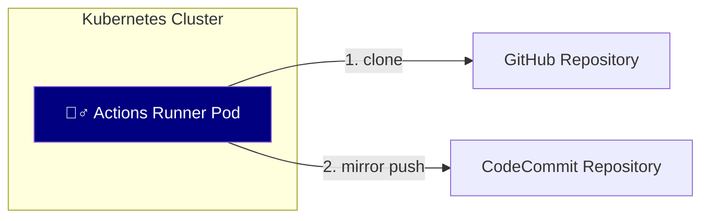

# actions

## set-locale

An Actions Workflow to set locale in runner environment.

## sync-ghe-to-codecommit

An Actions Workflow to synchronize a repository located on GitHub Cloud or GitHub Enterprise Server to AWS CodeCommit.

### System Architecture

