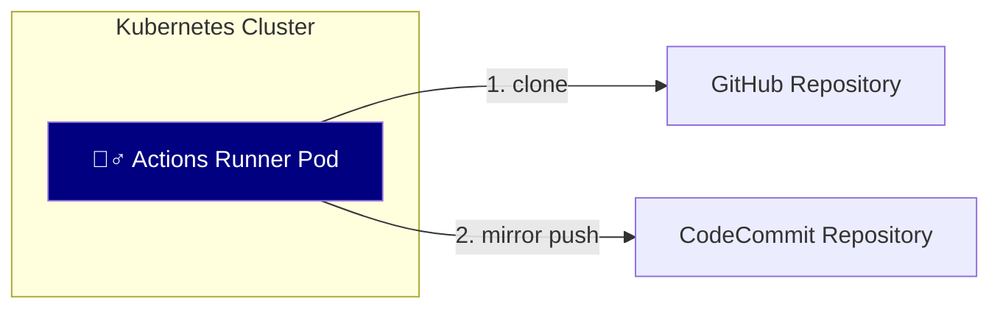
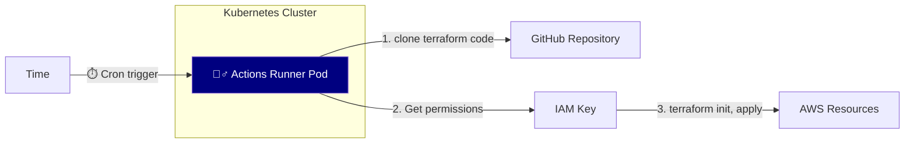

# actions

## set-locale

> It is designed to run in a **GitHub Enterprise Server** environment.

An Actions Workflow to set locale in runner environment.

## sync-ghe-to-codecommit

> It is designed to run in a **GitHub Enterprise Server** environment.

An Actions Workflow to synchronize a repository located on GitHub Cloud or GitHub Enterprise Server to AWS CodeCommit.

### System Architecture



## terraform-apply-cron

> It is designed to run in a **GitHub Enterprise Server** environment.

This GitHub Actions workflow is set up to automatically run a Terraform script every day at 1 AM KST.

```yaml
on:
  schedule:
    # Run KST 01:00 AM by cron trigger
    - cron:  '0 16 * * *'
```

It starts by checking out the code, setting up node.js and terraform, and configuring AWS credentials. Then, it formats<sup>`fmt`</sup> and `validate` the terraform code, and `apply` terraform codes located in the specified path.


