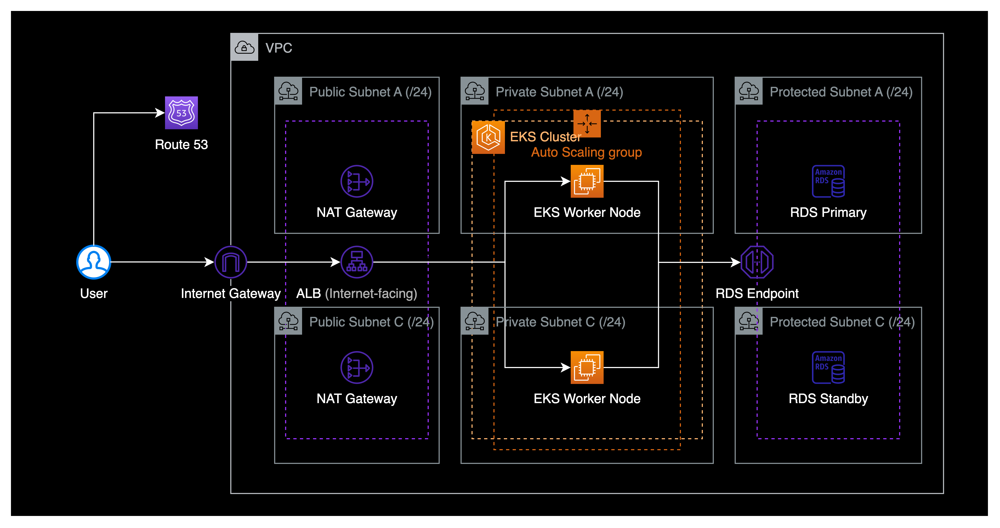
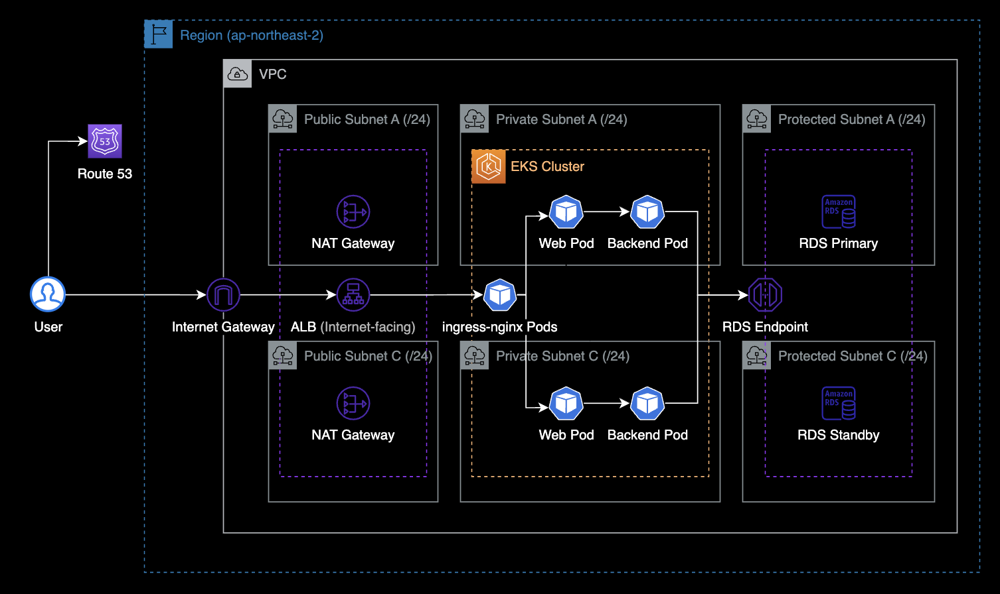
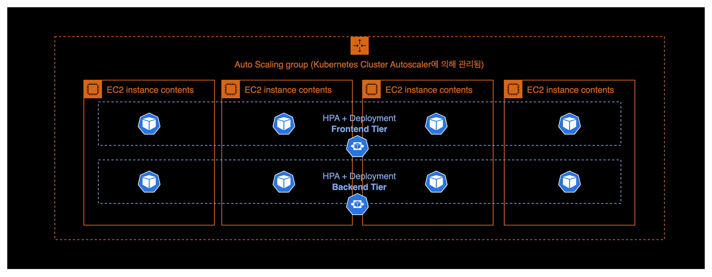
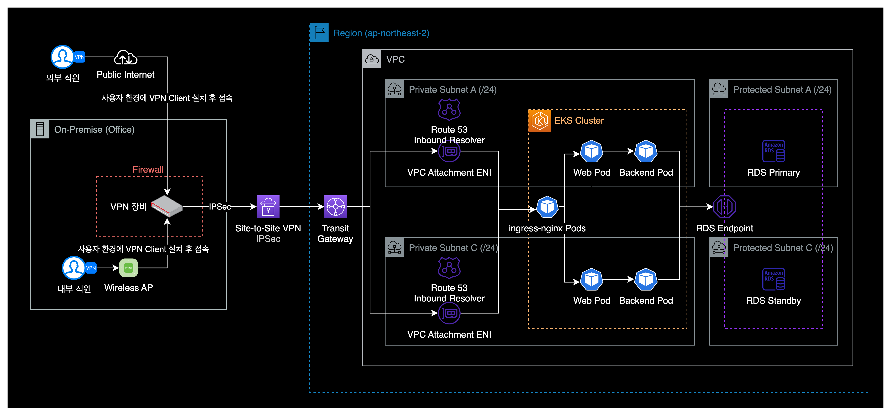
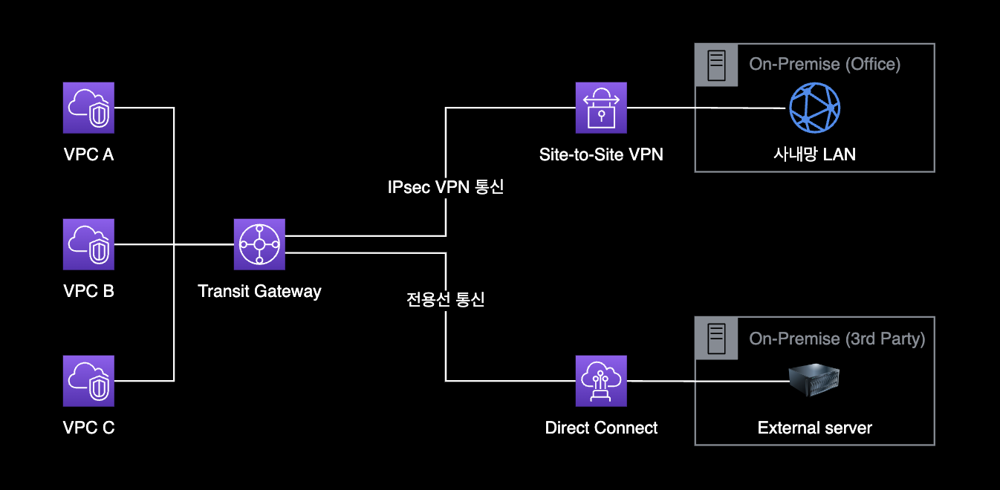
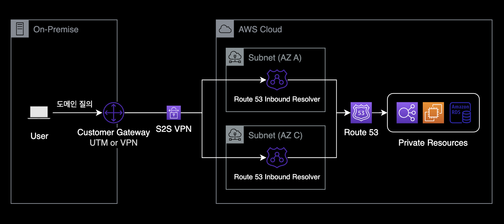
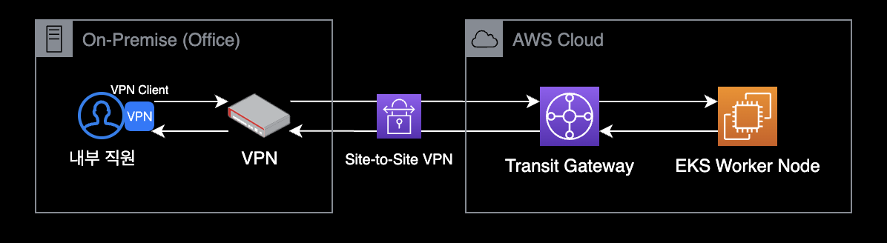

# DevOps Engineer 지원자 사전 과제

## 개요

**DevOps Engineer 지원자 사전 과제 결과물입니다.**

| 작성자           | 이윤성 (cysl@kakao.com)    |
|----------------|---------------------------|
| 작성완료일        | 2023-04-29 (토) 오후 04:04 |
| 지원 회사 및 포지션 | 코인원 / DevOps Engineer   |

<aside>
ℹ️ 보고 계신 자료의 텍스트는 Notion, 시스템 아키텍처는 draw.io를 사용해서 작성했습니다.
</aside>

&nbsp;

## 시나리오

당신은 초기 스타트업 회사의 DevOps 엔지니어입니다. 회사는 커머스 웹사이트 1차 개발을 마치고 Production 런칭을 준비하고 있고, 개발 환경은 Front-end (AngularJS), Back-end (Java), Database(MySQL) 입니다.

&nbsp;

## 작업1

Production 환경 구축시, 회사의 가장 중요한 요구사항은 단일 장애점(SPOF) 에 대응할 수 있는 고가용성(High Availability) 아키텍처입니다. 퍼블릭 클라우드에서 고가용성을 위해 설계한 시스템 아키텍처 다이어그램과 세부 설명을 작성해 주세요.

&nbsp;

### 답변1

#### **네트워크 설계**

그림1. 네트워크 및 컴퓨팅 리소스 관점의 AWS 구성도

기본적인 구성은 3 Tier 구성으로 가져갑니다. 프론트엔드, 백엔드의 워크로드는 쿠버네티스(EKS) 기반입니다. 데이터베이스는 관리형 서비스인 RDS를 사용했습니다.

- **Public Subnet** `ALB` `NGW`
    - 공개된 서브넷입니다. ALB에 Public IP가 부여됩니다.
    - Internet facing ALB와  NAT Gateway가 위치합니다.
    - Internet Gateway를 통해 외부로 인바운드, 아웃바운드가 가능합니다.
- **Private Subnet** `EC2` `EKS`
    - 프라이빗 서브넷이며 EC2에 Private IP만 부여됩니다.
    - EC2 기반의 EKS Cluster가 위치합니다. EKS Worker Node(EC2) 내부에는 프론트엔드와 백엔드 파드가 배포됩니다.
    - Private Subnet에 위치한 EC2는 ALB의 트래픽만 인바운드 가능합니다.
        - 서버 관리를 위한 원격접속 프로토콜로 SSH 대신 SSM Session Manager를 사용할 것이기 때문에 Bastion Host와 SSH 인바운드 허용은 필요 없습니다.
    - 외부 인터넷을 통해 Private Subnet으로 직접적인 인바운드는 불가능합니다. 인터넷 아웃바운드는 NAT Gateway를 통해 외부 인터넷으로 나갈 수 있습니다.
- **Protected Subnet** `RDS`
    - 격리된 서브넷이며 RDS for MySQL에 Private IP가 부여됩니다.
    - RDS for MySQL과 Redis와 같은 데이터베이스 리소스만 위치하는 격리된 서비스넷입니다. RDS for MySQL은 Private Subnet 인스턴스하고만 통신할 수 있습니다.

&nbsp;

#### 고가용성 설계

그림2. 쿠버네티스 관점의 AWS 구성도

고가용성을 위해 각 컴포넌트별로 2개의 가용영역을 사용했습니다.

- **네트워크**
    - 모든 서브넷은 2개의 가용영역에 리소스를 배치하기 위해 서울리전의 A, C 가용영역을 같이 사용합니다.
- **로드밸런서**
    - Application Load Balancer를 사용하며, 고가용성을 위해 Multi AZ로 운영됩니다. ALB는 Public Subnet A, C에 배치합니다.
    - 2개의 가용영역에 배치된 EC2와 통신이 가능하도록 ALB의 Cross-zone Load Balancing 기능이 활성화되어 있습니다.
- **NAT Gateway**
    - Public 타입의 NAT Gateway는 A, C 가용영역에 모두 배치합니다.
- **EKS Cluster**
    
    
    
    그림3. EKS 워커노드와 Pod 영역의 고가용성 동작방식
    
    - 모든 Frontend와 Backend 어플리케이션은 EKS 클러스터 내부에 파드 형태로 배포됩니다.
    - EKS Worker Node는 Launch Template과 Auto Scaling Group(ASG)으로 관리됩니다. 실질적인 스케일 인/아웃은 Kubernetes Cluster Autoscaler(Pod)의 Auto Scaling Group 조작을 통해 처리됩니다.
    - Pod 레벨의 스케일 인/아웃은 쿠버네티스 내부 리소스인 Horizontal Pod Autoscaler(HPA)에 의해 CPU, Memory 메트릭 기반으로 스케일 인/아웃이 실행됩니다.
    - Pod의 고가용성을 위해 쿠버네티스 내부 리소스인 Deployment에 의해 배포됩니다. Deployment는 항상 4개의 파드를 유지하도록 `replicas: 4`로 설정합니다.
    - Horizontal Pod Autoscaler가 Deployment의 파드 개수를 제어하므로 프론트엔드, 백엔드 레이어의 파드 개수는 언제든지 유동적으로 변경될 수 있습니다.
- **RDS for MySQL**
    - RDS는 A,C 가용영역을 같이 사용합니다.
    - RDS Primary - Standby로 구성합니다. Primary는 A 가용영역에 배치, Standby는 C 가용영역에 배치합니다.
    - RDS Primary 인스턴스 장애 발생시 Standby 인스턴스로 Auto Failover 됩니다. 이 때, Backend 파드가 바라보는 RDS의 엔드포인트는 변경되지 않습니다.
    - 데이터 손실을 대비해서 RDS 스냅샷을 14일 이상 보관하도록 설정하고, Point-in-Time Recovery(PITR) 기능을 활성화합니다.

&nbsp;

## 작업2

위 Production 환경에 Admin 사이트도 같이 배포되어 있으며 외부 접근은 차단한 상태입니다. 사내 및 사외에서 일부 운영자들이 Admin 사이트에 접근할 수 있는 환경 설정을 편하신 방법으로 작성해 주세요.

&nbsp;

### 답변2

온프레미스 VPN 장비와 Transit Gateway 간에 Site-to-Site VPN을 연결한 후, 내/외부 직원을 Private Subnet으로 접근할 수 있도록 네트워크 경로를 구성합니다.

- **VPN 네트워크 생성 :** VPN 장비와 Transit Gateway 간에 Site-to-Site VPN 연결을 구성합니다.
    - 어드민 페이지에 접근하는 모든 내부/외부 직원은 로컬 환경에 VPN Client 설치 및 실행해야만 VPN에 연결할 수 있습니다.
    - VPN 연결 시에만 어드민 페이지에 접속 가능합니다. 해당 어드민 페이지는 EKS 클러스터 내부의 파드 형태로 배포, 운영되고 있습니다.
    - 어드민 페이지에 대한 파드는 Private Subnet에 위치해 있으므로 퍼블릭 인터넷 경로로 직접 접근은 불가능합니다.
- **Transit Gateway와 VPC 연결**
    - Private Subnet A, C에 2개의 VPC Attachment를 생성합니다.
    - VPC Attachment를 수락하면 Private Subnet A, C에 VPC Attachment용 ENI가 생성됩니다.
    - **Transit Gateway를 사용한 이유**
        
        
        
        그림5. Transit Gateway의 확장 가능한 사용 사례
        
        - 추후 Direct Connect 전용선이 필요할 경우 네트워크 변경 없이 Transit Gateway만으로 구성 가능합니다.
        - 동일한 VPN Connection에 여러 개의 VPC를 같이 연결할 수 있습니다.
        - 또한 여러 개의 VPN Connection을 하나의 Transit Gateway로도 관리할 수 있습니다.
- **DNS 구성**
    
    
    
    그림6. Route 53 Inbound Resolver 동작방식
    
    - Private A, C 서브넷에 Route 53 Inbound Resolver를 생성합니다.
    - VPN 장비에서는 Transit Gateway의 내부 admin 페이지로 접근 가능하도록 Route 53 Inbound Resolver를 DNS Resolver로 등록합니다.
    - 예시로 VPN 사용자는 브라우저에서 `admin.doge-company.com` 으로 접근할 경우, Route 53 Inbound Resolver의 응답을 통해 AWS Private 도메인으로 접근할 수 있습니다.
- **라우팅 테이블 수정**
    - Private A, C 서브넷의 라우팅 테이블에 VPN 사용자 네트워크 대역인 경우, Transit Gateway로 보내도록 설정합니다. (e.g. `172.16.0.0/16` to tgw-xxxxx)
    - Transit Gateway는 EKS 워커 노드의 응답을 받아서 온프레미스 오피스에 위치한 VPN Router로 패킷을 전달합니다.
    - Transit Gateway가 VPN 장비로 응답을 준 이후의 트래픽 처리는 VPN 장비가 맡아서 라우팅 됩니다.
    - 사용자는 VPN 장비로부터 어드민 페이지의 응답을 받았기 때문에 정상적으로 어드민 페이지를 접속할 수 있게 됩니다.
        
        
        
EOD.