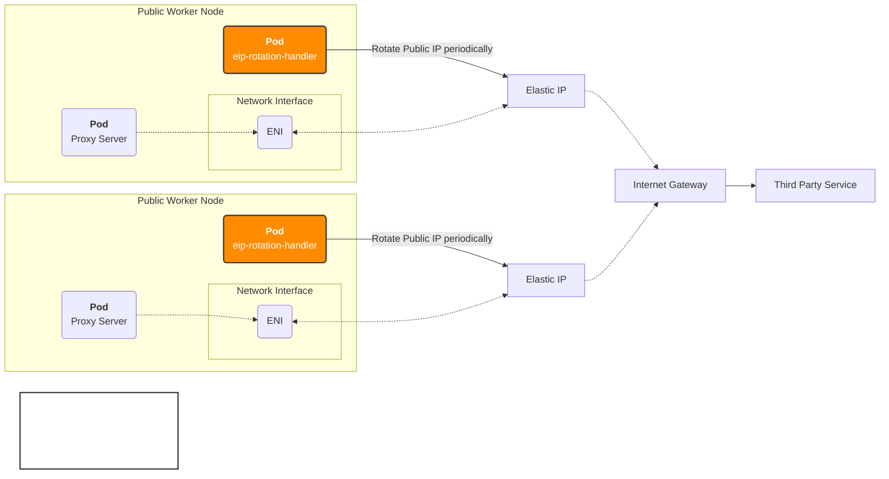

# EIP Rotation Handler

Automatically rotate AWS [Elastic IPs](https://docs.aws.amazon.com/AWSEC2/latest/UserGuide/elastic-ip-addresses-eip.html) on Kubernetes worker nodes to bypass IP-based rate limits for forward proxy servers.

**Key Technology**: Uses AWS EC2 Instance Metadata Service (IMDS) to automatically discover node information including instance ID, current public IP, and region without requiring additional IAM configuration.

## Architecture

System architecture for EIP rotation handler:



### How It Works

1. **DaemonSet Deployment**: The handler deploys as a DaemonSet to worker nodes labeled with `node-type: public` as a example, ensuring one pod per proxy server node.

2. **Automatic Instance Discovery via IMDS**: Each pod automatically discovers node information by querying the EC2 Instance Metadata Service (IMDS) at `169.254.169.254`:
   - **Instance ID**: Identifies the current worker node (`/latest/meta-data/instance-id`)
   - **Current Public IP**: Gets current public IPv4 address (`/latest/meta-data/public-ipv4`)
   - **AWS Region**: Determines the node's region (`/latest/meta-data/placement/region`)
   - **IMDS Version Support**: Supports both IMDSv1 (direct access) and IMDSv2 (token-based) with automatic fallback

3. **EIP Rotation Process**:
   - **Allocate**: Request a new Elastic IP from AWS
   - **Associate**: Attach the new EIP to the worker node's ENI
   - **Release**: Deallocate the previous EIP to avoid charges
   - **Rollback**: If association fails, automatically release the new EIP

4. **Rate Limit Bypass**: Proxy servers automatically use the new public IP for outbound traffic, effectively resetting rate limit counters on third-party services.

5. **Continuous Operation**: The process repeats every 10 minutes (configurable), ensuring fresh IP addresses for sustained proxy operations.

## Features

- **IP Rotation**: Periodic EIP rotation to bypass rate limits (default 10min)
- **Proxy Server Support**: Designed for forward proxy servers on public nodes
- **Zero Downtime**: Seamless IP transitions with automatic rollback
- **Health Monitoring**: Built-in `/healthz` endpoint

## Prerequisites

- Kubernetes cluster on AWS EKS
- EKS Worker nodes need attached IAM role with `ec2:AllocateAddress`, `ec2:AssociateAddress`, `ec2:DescribeAddresses`, `ec2:ReleaseAddress` permissions to control Elastic IPs.
- **IMDS Access**: Nodes must have access to EC2 Instance Metadata Service (enabled by default on EC2 instances)
- No IRSA (IAM Roles for Service Accounts) required - uses EC2 instance IAM role directly via IMDS.

## Installation

Currently, only Helm chart deployment is supported.

### Helm chart

```bash
# Create namespace first
kubectl create namespace eip-rotation-handler

# Install chart (default: daemonset mode)
helm install eip-rotator ./deploy/helm/eip-rotation-handler \
  --namespace eip-rotation-handler

# Custom configuration
helm install eip-rotator ./deploy/helm/eip-rotation-handler \
  --namespace eip-rotation-handler \
  --set deploymentMode=daemonset \
  --set rotation.intervalMinutes=10
```

## Configuration

| Variable | Default | Description |
|----------|---------|-------------|
| `deploymentMode` | `daemonset` | Deployment mode (daemonset) |
| `ROTATION_INTERVAL_MINUTES` | `10` | Rotation interval |
| `LOG_LEVEL` | `info` | Log level |
| `METADATA_URL` | `http://169.254.169.254/latest/meta-data` | EC2 Instance Metadata Service URL |
| `IMDS_VERSION` | `auto` | IMDS version preference (`auto`, `v1`, `v2`) |

## Monitoring

```bash
# Check status
kubectl get pods -l app.kubernetes.io/name=eip-rotation-handler -n eip-rotation-handler

# View logs  
kubectl logs -f -l app.kubernetes.io/name=eip-rotation-handler -n eip-rotation-handler

# Health check
kubectl exec -it <pod> -n eip-rotation-handler -- curl localhost:8080/healthz
```

## License

MIT