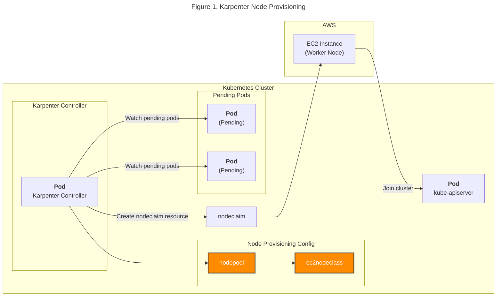
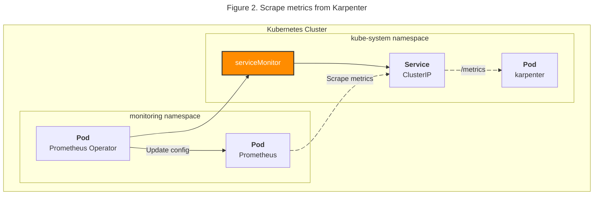

# Karpenter

## Summary

System diagram written in [Mermaid](https://mermaid.js.org/). All diagrams are related to Karpenter.

## Mermaid diagrams

### Figure 1

&nbsp;

### Figure 2

&nbsp;

### Figure 3

```mermaid
---
title: "Figure 3. Helm chart structure of Karpenter"
---
flowchart LR
  admin("👨ðŸ»â€ðŸ’¼ Cluster Admin")
  subgraph "Cluster"
    subgraph "kube-system"
      subgraph "karpenter chart"
        kc["`karpenter
          Main chart`"]
        knpc["`karpenter-nodepool chart
              Subchart`"]
      end

      kcp["`**Pod**
            karpenter controller`"]
      np["`**Custom Resource**
          nodepool`"]
      ec2nc["`**Custom Resource**
              ec2nodeclass`"]
    end
  end

  admin --helm install--> kc & knpc
  kc --> kcp
  knpc --> np & ec2nc

  style kc fill:darkblue
  style knpc fill:darkblue
```

