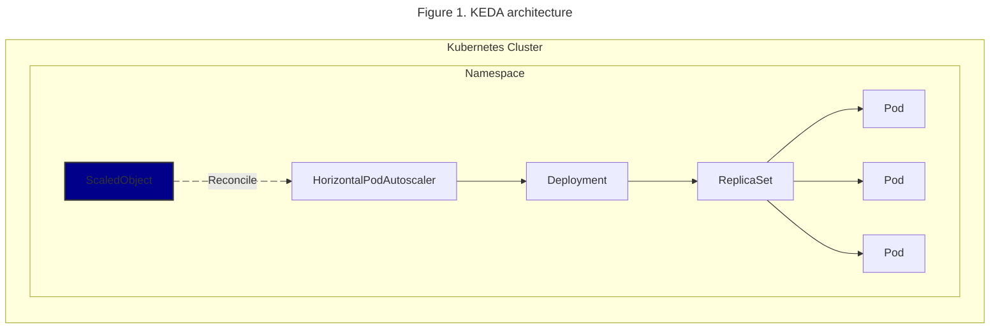
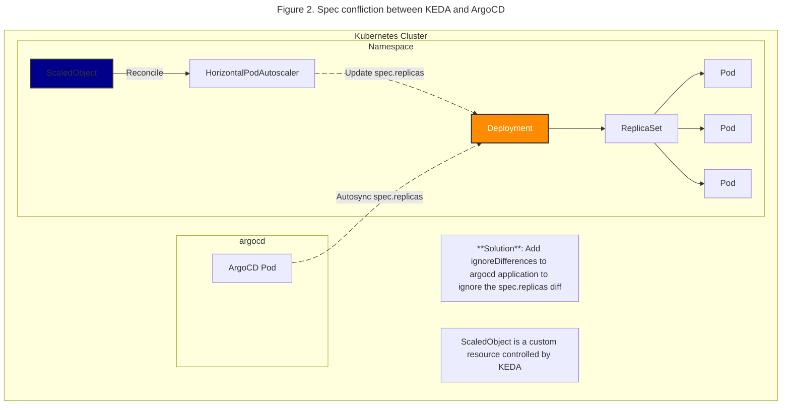

# keda

## Summary

System diagram written in [Mermaid](https://mermaid.js.org/). All diagrams are related to KEDA.

## Mermaid diagrams

### Figure 1

```mermaid
---
title: "Figure 1. KEDA architecture"
---
flowchart LR
  subgraph "Kubernetes Cluster"
    subgraph "Namespace"
      so["ScaledObject"]
      hpa["HorizontalPodAutoscaler"]
      d["Deployment"]
      r["ReplicaSet"]
      p1["Pod"]
      p2["Pod"]
      p3["Pod"]
    end
  end

  so e1@--Reconcile--> hpa --> d --> r --> p1 & p2 & p3

  style so fill:darkblue,stroke:#333,stroke-width:2px
  e1@{ animate: true }
```

### Figure 2

```mermaid
---
title: "Figure 2. Spec confliction between KEDA and ArgoCD"
---
flowchart LR
  subgraph sk["Kubernetes Cluster"]
    direction LR
    subgraph "Namespace"
      so["ScaledObject"]
      hpa["HorizontalPodAutoscaler"]
      d["Deployment"]
      r["ReplicaSet"]
      p1["Pod"]
      p2["Pod"]
      p3["Pod"]
    end

    subgraph "argocd"
      argo["ArgoCD Pod"]
    end

    note1["**Solution**: Add ignoreDifferences to argocd application to ignore the spec.replicas diff"]
    note2["ScaledObject is a custom resource controlled by KEDA"]
  end

  so --Reconcile--> hpa e1@--Update spec.replicas--> d --> r --> p1 & p2 & p3
  argo e2@--Autosync spec.replicas--> d

  sk ~~~ note1
  argocd ~~~ note2

  style so fill:darkblue,stroke:#333,stroke-width:2px
  style d fill:darkorange,color:white,stroke:#333,stroke-width:2px

  e1@{ animate: true }
  e2@{ animate: true }
```