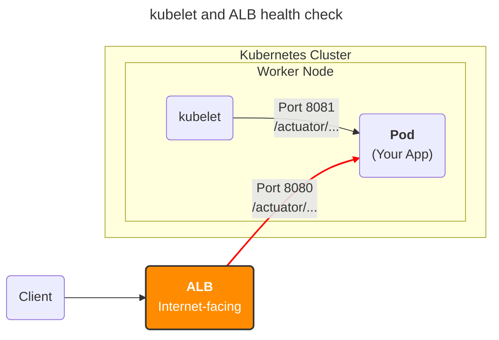
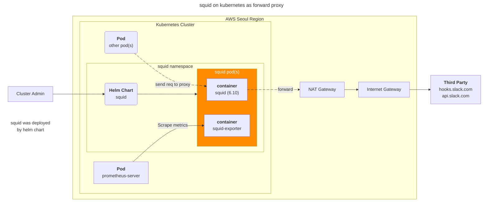

# kubernetes

## Summary

System diagram written in [Mermaid](https://mermaid.js.org/). All diagrams are related to kubernetes.

## Mermaid diagrams

```mermaid
---
title: kubelet and ALB health check
---
flowchart LR
    subgraph "Kubernetes Cluster"
        subgraph "Worker Node"
            kubelet("kubelet")
            pod("`**Pod**
            (Your App)`")
        end
        
        kubelet -- "Port 8081<br/>/actuator/..." --> pod
    end

    alb("`**ALB**
        Internet-facing`")

    alb -- "Port 8080<br/>/actuator/..." --> pod
    client("Client") --> alb

    style alb fill:darkorange, color:white, stroke:#333, stroke-width:2px
    linkStyle 1 stroke:red,stroke-width:2px
```

```mermaid
---
title: squid on kubernetes as forward proxy
---
flowchart LR
    admin["Cluster Admin"]
    admin --> helm
    subgraph "AWS Seoul Region"
        subgraph "Kubernetes Cluster"
            subgraph "squid namespace"
                subgraph squid["squid pod(s)"]
                    c1["`**container**
                    squid (6.10)`"]
                    c2["`**container**
                    squid-exporter`"]
                end
                helm("`**Helm Chart**
                squid`")

                helm --> squid
            end

            cp("`**Pod**
            other pod(s)`")
            prom["`**Pod**
            prometheus-server`"]
            prom --Scrape metrics--> c2
        end

        ngw["NAT Gateway"]
        igw["Internet Gateway"]
    end
    slack["`**Third Party**
    hooks.slack.com
    api.slack.com`"]
    cp e1@--send req to proxy--> c1 e2@--forward--> ngw --> igw -->slack
    note["`squid was deployed
    by helm chart`"]

    style squid fill:darkorange, color:white
    style note fill:transparent, stroke:transparent

    e1@{ animate: true }
    e2@{ animate: true }
```