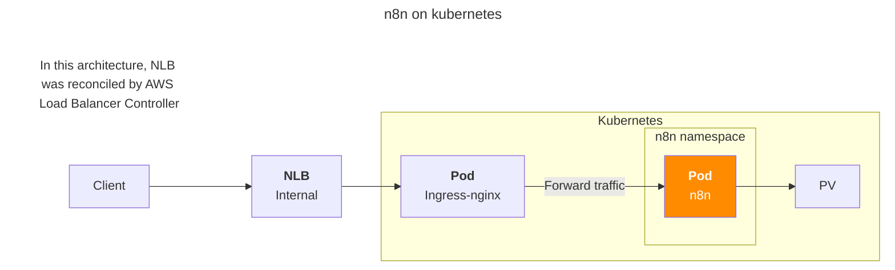
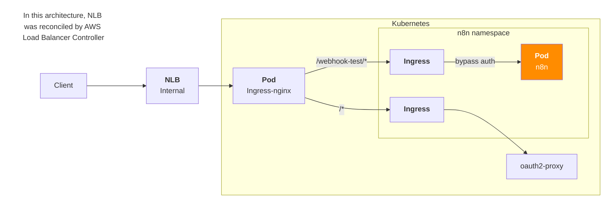
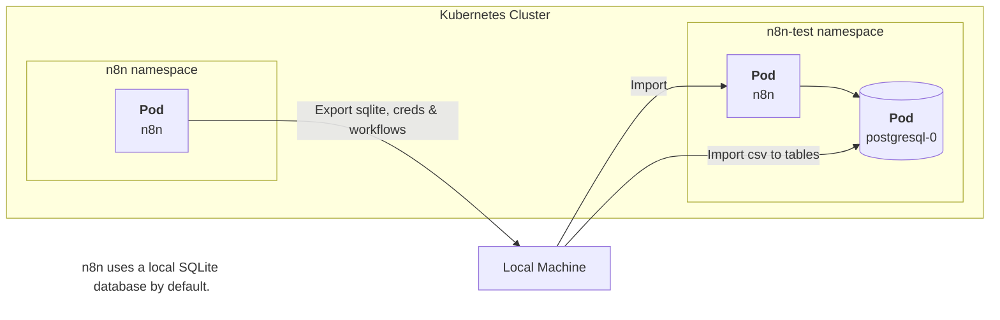

Recommended kubernetes architecture with [ingress-nginx-controller](https://github.com/kubernetes/ingress-nginx):

```mermaid
---
title: n8n on kubernetes
---
flowchart LR
  note["In this architecture, NLB was reconciled by AWS Load Balancer Controller"]
  c["Client"]
  lb["`**NLB**
  Internal`"]
  subgraph k8s["Kubernetes"]
    i["`**Pod**
    Ingress-nginx`"]
    subgraph n8n["n8n namespace"]
      n["`**Pod**
      n8n`"]
    end
    p["PV"]
  end

  c --> lb --> i --Forward traffic--> n --> p

  style n8n stroke-array: dash 5 5
  style n fill: darkorange, color: white
  style note stroke: transparent, fill: transparent
```

oauth2-proxy bypass:

```mermaid
flowchart LR
  note["In this architecture, NLB was reconciled by AWS Load Balancer Controller"]
  c["Client"]
  lb["`**NLB**
  Internal`"]
  subgraph k8s["Kubernetes"]
    i["`**Pod**
    Ingress-nginx`"]
    subgraph n8n["n8n namespace"]
      ing1["`**Ingress**`"]
      ing2["`**Ingress**`"]
      n["`**Pod**
      n8n`"]
    end
    o["oauth2-proxy"]
  end

  c --> lb --> i --/*--> ing1 --> o
  i --/webhook-test/*--> ing2 --bypass auth--> n

  style n8n stroke-array: dash 5 5
  style n fill: darkorange, color: white
  style note stroke: transparent, fill: transparent
```

n8n database migration from sqlite to postgresql:

```mermaid
flowchart LR
  note["n8n uses a local SQLite database by default."]
  subgraph k8s["Kubernetes Cluster"]
    subgraph ns1["n8n namespace"]
      pn["`**Pod**
      n8n`"]
    end
    subgraph ns2["n8n-test namespace"]
      pn2["`**Pod**
      n8n`"]
      pdb[("`**Pod**
      postgresql-0`")]
    end
  end
  l["Local Machine"]

  pn --Export sqlite, creds & workflows--> l
  pn2 --> pdb
  l --Import csv to tables--> pdb
  l --Import--> pn2

  style note stroke: transparent, fill: transparent
```
