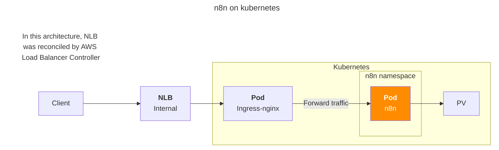

Recommended kubernetes architecture with [ingress-nginx-controller](https://github.com/kubernetes/ingress-nginx):

```mermaid
---
title: n8n on kubernetes
---
flowchart LR
  note["In this architecture, NLB was reconciled by AWS Load Balancer Controller"]
  c["Client"]
  lb["`**NLB**
  Internal`"]
  subgraph k8s["Kubernetes"]
    i["`**Pod**
    Ingress-nginx`"]
    subgraph n8n["n8n namespace"]
      n["`**Pod**
      n8n`"]
    end
    p["PV"]
  end

  c --> lb --> i --Forward traffic--> n --> p

  style n8n stroke-array: dash 5 5
  style n fill: darkorange, color: white
  style note stroke: transparent, fill: transparent
```
