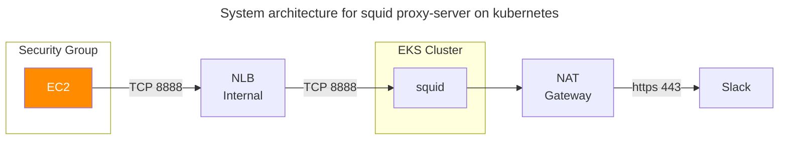

```mermaid
---
title: System architecture for squid proxy-server on kubernetes
---
flowchart LR
  subgraph esg["Security Group"]
    e["EC2"]
  end
  n["`NLB
  Internal`"]
  subgraph k8s["EKS Cluster"]
    p["squid"]
  end
  ngw["`NAT
  Gateway`"]
  s["Slack"]

  e --TCP 8888--> n --TCP 8888--> p --> ngw --https 443--> s
  style e fill: darkorange, color: white
  style esg fill: transparent
```
