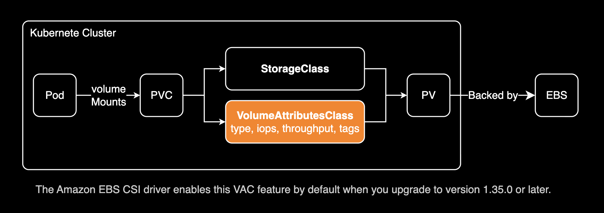

# gp3-migration

## Summary

All gp2 type EBS volumes located in the specified AWS Region are converted to gp3.

## Important Announcement

There are **three methods** to migrate EBS gp2 volumes to gp3 in Kubernetes: **Volume Attributes Class** (declarative), **PVC Annotation** (imperative), and **VolumeSnapshot** (legacy).

### 1. Volume Attributes Class (VAC) - Declarative Approach

For Kubernetes **1.31+** with EBS CSI driver **v1.35.0+** (EKS managed add-on v1.35.0-eksbuild.2+). `VolumeAttributesClass` feature gate is automatically enabled on EKS - no additional configuration needed. Best for GitOps workflows and managing multiple volumes with standardized profiles.



```yaml
# Step 1: Create VolumeAttributesClass
apiVersion: storage.k8s.io/v1beta1
kind: VolumeAttributesClass
metadata:
  name: gp3-migration
driverName: ebs.csi.aws.com
parameters:
  type: gp3
  iops: "3000"
  throughput: "125"
```

```yaml
# Step 2: Update PVC to reference the VolumeAttributesClass
apiVersion: v1
kind: PersistentVolumeClaim
metadata:
  name: my-app-data
spec:
  accessModes:
    - ReadWriteOnce
  resources:
    requests:
      storage: 100Gi
  storageClassName: gp2
  volumeAttributesClassName: gp3-migration  # Add this field
```

Or apply using kubectl:

```bash
kubectl patch pvc <pvc-name> \
  --type merge \
  --patch '{"spec":{"volumeAttributesClassName":"gp3-migration"}}'
```

**Note**: `storageClassName` and `volumeAttributesClassName` can be different. The `storageClassName` (e.g., `gp2`) represents the original StorageClass used when the PV was **first created** and cannot be changed. The `volumeAttributesClassName` (e.g., `gp3-migration`) is used to **modify the existing PV's attributes** in-place. This is the expected pattern for volume migration scenarios.

### 2. PVC Annotation - Quick Migration

For CSI driver **v1.19.0+**. Simplest approach for one-off migrations with zero downtime.

```bash
kubectl annotate pvc <pvc-name> ebs.csi.aws.com/volumeType="gp3"
```

### 3. VolumeSnapshot - Legacy Approach

**⚠️ Outdated method** - Works with any CSI driver version but requires pod restart and creates new volumes. This approach is no longer recommended because it causes downtime and doesn't support in-place migration. Use VAC or PVC Annotation for zero-downtime migrations instead.

**Recommended approach**: Use **VAC** for declarative infrastructure management, **PVC Annotation** for quick migrations, or **VolumeSnapshot** when you need backup guarantees during migration.

### Migration Method Comparison

| Aspect | Volume Attributes Class | PVC Annotation Method | VolumeSnapshot Method |
|--------|------------------------|----------------------|----------------------|
| **Complexity** | Moderate (3-4 steps) | Simple (1 command) | Complex (5+ steps) |
| **Downtime** | None | None | Requires pod restart |
| **Existing Volumes** | Migrates in-place | Migrates in-place | Creates new volumes |
| **K8s Version** | 1.31+ | Any | Any |
| **CSI Driver Required** | v1.35.0+ | v1.19.0+ | Any version |
| **Risk Level** | Low | Low | Medium |
| **Management Style** | Declarative (GitOps) | Imperative (ad-hoc) | Manual |
| **Reusability** | High (profiles) | Low | Low |
| **Best For** | Infrastructure as Code | Quick migrations | Backup during migration |
| **Approach** | Create VAC → Patch PVC | `kubectl annotate pvc` | Create snapshot → Restore |
| **Guide** | [AWS Blog](https://aws.amazon.com/ko/blogs/containers/modify-amazon-ebs-volumes-on-kubernetes-with-volume-attributes-classes/) | [AWS re:Post](https://repost.aws/knowledge-center/eks-migrate-ebs-volume-g3) | [AWS Blog](https://aws.amazon.com/ko/blogs/containers/migrating-amazon-eks-clusters-from-gp2-to-gp3-ebs-volumes/) |

**This script is still useful for**:
- Migrating standalone EBS volumes not managed by Kubernetes
- Bulk migration of existing gp2 volumes across multiple AWS accounts/regions
- Environments using older versions of aws-ebs-csi-driver

## Precautions

- Each EBS volume can only be modified once **every 6 hours**.
- **Online migration**: EBS volume type changes can be performed without detaching the volume (no downtime)
- **Performance impact**: Temporary I/O performance degradation may occur during migration
- **Database workloads**: For production databases, run during low-traffic periods
- See [AWS EBS volume modification documentation](https://docs.aws.amazon.com/ebs/latest/userguide/ebs-modify-volume.html#elastic-volumes-considerations) for detailed requirements and limitations.

## Example

```bash
export AWS_PROFILE=dev
sh gp3_migration.sh
```

```bash
[i] Start finding all gp2 volumes in ap-northeast-2
[i] List up all gp2 volumes in ap-northeast-2
=========================================
vol-1234567890abcdef0
vol-0987654321abcdef0
vol-abcdefgh123456780
vol-ijklmnop123456780
vol-12345678abcdefgh0
vol-098765abcdef12340
vol-abcdef12345678900
=========================================
Do you want to proceed with the migration? (y/n): y
[i] Starting volume migration...
[i] Migrating all gp2 volumes to gp3
[i] Volume vol-1234567890abcdef0 changed to state 'modifying' successfully.
[i] Volume vol-0987654321abcdef0 changed to state 'modifying' successfully.
[i] Volume vol-abcdefgh123456780 changed to state 'modifying' successfully.
[i] Volume vol-ijklmnop123456780 changed to state 'modifying' successfully.
[i] Volume vol-12345678abcdefgh0 changed to state 'modifying' successfully.
[i] Volume vol-098765abcdef12340 changed to state 'modifying' successfully.
[i] Volume vol-abcdef12345678900 changed to state 'modifying' successfully.
[i] All gp2 volumes have been migrated to gp3 successfully!
```

## References

- [Blog post](https://younsl.github.io/blog/script-gp2-volumes-to-gp3-migration/)
- [AWS EBS volume modification documentation](https://docs.aws.amazon.com/ebs/latest/userguide/ebs-modify-volume.html#elastic-volumes-considerations)
- [Migrating Amazon EKS clusters from gp2 to gp3 EBS volumes](https://aws.amazon.com/ko/blogs/containers/migrating-amazon-eks-clusters-from-gp2-to-gp3-ebs-volumes/)
