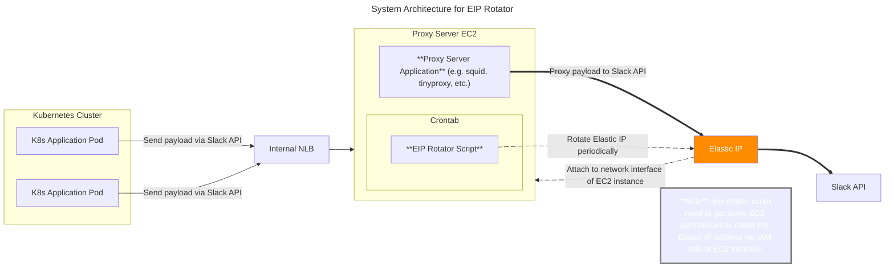

# eip-rotator

[](https://github.com/younsl/box/releases) [](https://github.com/younsl/box/blob/main/LICENSE)

## Description

This script rotates the [Elastic IP address](https://docs.aws.amazon.com/AWSEC2/latest/UserGuide/elastic-ip-addresses-eip.html) of the instance to avoid rate limit of 3rd party service (e.g. Slack, Discord, etc.).



## Prerequisites

### IAM Permissions

The following permissions are required to run the script.

- `ec2:ReleaseAddress`
- `ec2:AllocateAddress`
- `ec2:DescribeAddresses`
- `ec2:AssociateAddress`

<details>
<summary>IAM Policy for eip-rotator</summary>

Example IAM policy for eip-rotator is as follows.

> **Note**: Based on [AWS IAM Policy Elements: Sid](https://docs.aws.amazon.com/IAM/latest/UserGuide/reference_policies_elements_sid.html), the `Sid` element supports ASCII uppercase letters (A-Z), lowercase letters (a-z), and numbers (0-9).

```json
{
    "Version": "2012-10-17",
    "Statement": [
        {
            "Sid": "RotateElasticIPByEipRotator",
            "Effect": "Allow",
            "Action": [
                "ec2:ReleaseAddress",
                "ec2:AllocateAddress",
                "ec2:DescribeAddresses",
                "ec2:AssociateAddress"
            ],
            "Resource": "*"
        }
    ]
}
```

For more detailed information on each EC2 action, please refer to the [AWS Identity and Access Management documentation for Amazon EC2](https://docs.aws.amazon.com/service-authorization/latest/reference/list_amazonec2.html).

</details>

### CLI tools

The following CLI tools are required to run the script.

- [AWS CLI](https://awscli.amazonaws.com/v2/documentation/api/latest/reference/index.html): Battle-tested 2.25.13 version in production EC2 instance, so recommended to use awscli 2.25.13 or later.

## Usage

### Install

Download raw script file in current directory.

```bash
curl -O https://raw.githubusercontent.com/younsl/eip-rotator/main/eip-rotator.sh
```

Add eip-rotator schedule to crontab.

```bash
sh eip-rotator.sh start
crontab -l
```

Remove eip-rotator schedule from crontab.

```bash
sh eip-rotator.sh stop
crontab -l
```

### Manual run

Or you can run the script manually.

```bash
sh eip-rotator.sh
```

## License

This project is licensed under the MIT License. See the [LICENSE](https://github.com/younsl/box/blob/main/LICENSE) file for details.