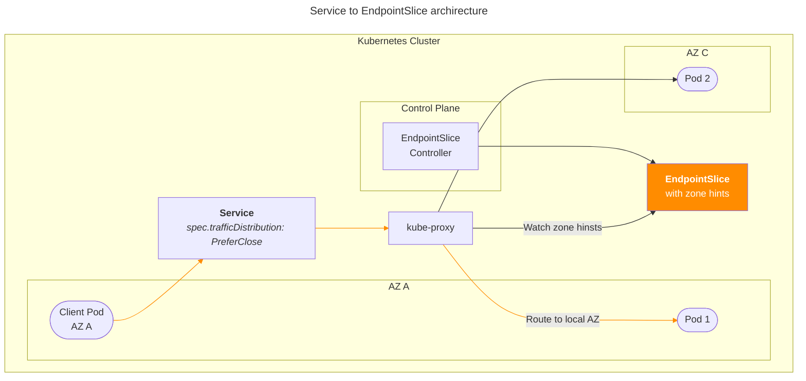

# Traffic Distribution Test


Real-time TCP connection monitoring tool for testing Kubernetes Service [trafficDistribution](https://kubernetes.io/docs/concepts/services-networking/service/#traffic-distribution) Local AZ communication. This tool validates zone-aware routing behavior by generating traffic and monitoring connection patterns to verify that requests are preferentially routed to endpoints within the same availability zone, reducing cross-zone network latency and costs.

## Background

### EndpointSliceController Architecture



[EndpointSliceController](https://kubernetes.io/docs/concepts/services-networking/topology-aware-routing/#implementation-control-plane) runs as part of the **kube-controller-manager** in the Kubernetes control plane. This controller is responsible for:

- Creating and managing [EndpointSlice](https://kubernetes.io/docs/concepts/services-networking/endpoint-slices/) objects automatically when Services with selectors are created
- Watching Services and Pods to ensure EndpointSlices reflect the current state of available endpoints
- Implementing zone-aware traffic distribution by adding topology hints to EndpointSlice objects
- Optimizing network traffic by enabling local AZ communication preferences

### Traffic Distribution Flow

The controller operates within the control plane and communicates with kube-proxy instances on worker nodes through the Kubernetes API server. Each kube-proxy watches for EndpointSlice changes and updates its routing rules accordingly to prefer local zone endpoints when the `trafficDistribution: PreferClose` policy is configured.

## Usage

Download the script:

```bash
# Using curl
curl -O https://raw.githubusercontent.com/younsl/box/main/box/scripts/traffic-distribution-test/conmon.sh

# Using wget
wget https://raw.githubusercontent.com/younsl/box/main/box/scripts/traffic-distribution-test/conmon.sh
```

Run the script:

```bash
sh conmon.sh
```

## Features

- Tests Service [trafficDistribution](https://kubernetes.io/docs/concepts/services-networking/service/#traffic-distribution) Local AZ communication functionality
- Monitors TCP connections to ports 80/8080 to verify traffic locality
- Generates background traffic to the target service
- Displays connection count per IP address to verify Local AZ preference
- Runs 20 monitoring cycles with 2-second intervals

## Sample Output

```
=== Traffic Distribution Test ===
Service: web-api.production.svc.cluster.local
Testing Local AZ communication...
Press Ctrl+C to stop

CHECK    [COUNT]  IP_ADDRESS
----------------------------------------
1/20     [12]     172.20.143.85
2/20     [10]     172.20.143.85
3/20     [10]     172.20.143.85
4/20     [10]     172.20.143.85
5/20     [12]     172.20.143.85
...
20/20    [9]      172.20.143.85

Monitoring completed.
```

## Configuration

Edit the SERVICE_NAME variable in `conmon.sh` to monitor your target service:

```bash
SERVICE_NAME="your-service.namespace.svc.cluster.local"
```
