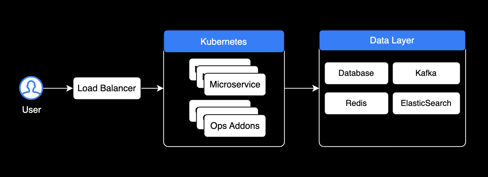
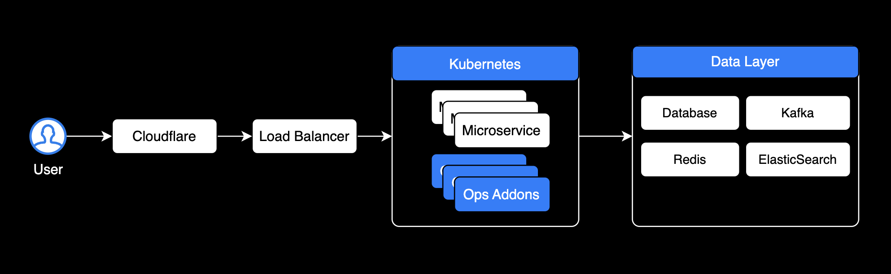
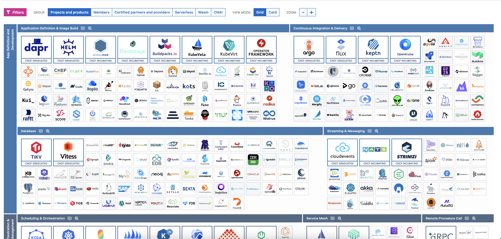
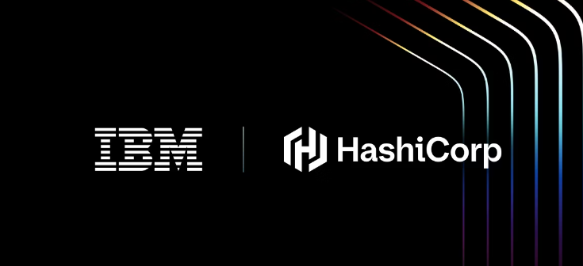

# Infrastructure for Sales

세일즈 및 프리세일즈를 위한 인프라 강의 by Younsung Lee

---

## Speaker 

### Younsung Lee

System Engineer (IDC) 6년, DevOps Engineer (AWS) 3년

[Github](https://github.com/younsl), [Blog](https://younsl.github.io/)

---

## 목표

- 현업(Field)에서 운영되는 클라우드 인프라의 전반적인 구조 및 방식 이해
- 각 영역별 솔루션 이해
- 인프라 상황별 필요한 솔루션

---

## Infrastructure architecture 1

---

## Infrastructure architecture 2

---

## Infrastructure architecture 3

Addon 영역에 엔터프라이즈 솔루션이 들어감

---

## 현재 인프라 표준(De facto)

- **Micro Service Architecture**: Kubernetes에 모든 소프트웨어 및 관리용 에드온들을 올리는 추세임
- **Cloud Native**: 클라우드 네이티브 관련 솔루션을 파는 것이 가장 전망이 좋음
- **Containerized**: 모두가 클라우드로 이전하면서 MSA 구조를 가져갔고 모든 소프트웨어가 컨테이너화되어 쿠버네티스 클러스터 내부에서 운영됨

---

CNCF 조감도 https://landscape.cncf.io/를 통해 전체적인 솔루션 현황과 트렌드를 파악한다

---

**IBM의 Hashicorp 인수**

메인 스트림이 된 클라우드 네이티브 솔루션 시장

[오픈소스 커뮤니티는 이에 우려를 표함](https://www.reddit.com/r/Terraform/comments/1cca1gy/hashicorp_joins_ibm_to_accelerate_multicloud/?rdt=44662)

---

## 필드에서 수요가 높은 Cloud Native 솔루션

- Istio (서비스메시)
- Vault (시크릿 관리)
- Terraform (코드로서 인프라)
- ArgoCD (쿠버네티스 배포 도구)
- Packer (이미지 빌드)

---

## 시나리오별 솔루션 적용 사례

- 쿠버네티스 내부 가시성 확보가 필요함 → Istio (OSS), Solo (Enterprise)
- 모니터링 → Prometheus, Grafana, Loki (모두 OSS)
- Database Monitoring이 부족한 것 같음 → 데이터독 (Enterprise)
- 개발자 생산성 향상 도구 → Copilot Business, Cursor
- 쿠버네티스 비용 → Kubecost (OSS & Enterprise)

---

## 엔지니어로서의 인사이트

- AWS가 등장하면서 인프라 관련 기술들이 대부분 클라우드 기반으로 이동하고 있음
- 모든 관리용 서비스와 비즈니스 로직이 컨테이너화되고 쿠버네티스 클러스터 내부에서 운영되고 있음
- 결제조차 AWS Account에 연결된 Credit Card에 의해 결제되는 비율이 높음
- Megazone Cloud 등의 MSP사의 출몰로 인해 엔터프라이즈 프로덕트 판매 기업들은 더 경쟁이 치열해진 듯

---

## Enterprise Software가 마주한 허들 

1. **AWS Marketplace** : 결제 지불도 편하고, 엔지니어들은 AWS 콘솔이 익숙함
  - 총판사의 가격 인하가 크지 않으면 이 방식으로 구매 및 운영
2. **활발한 CNCF Ecosystem** : 쿠버네티스 커뮤니티가 크고 무료로 쓰기 미안할 정도로 좋은 오픈소스 솔루션이 많음

---

## 유용한 자료

- [DevOps Roadmap](https://roadmap.sh/devops)
- [CNCF Landscape](https://landscape.cncf.io/)
