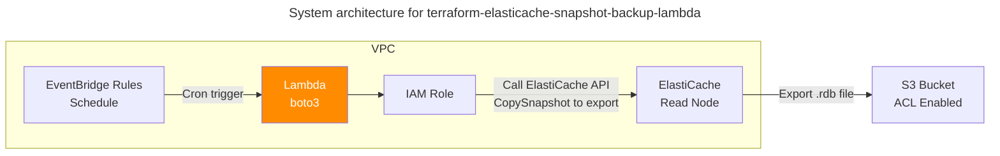

# terraform-elasticache-snapshot-backup-lambda

## System Architecture

Lambda Function이 Boto3의 [ElastiCache API](https://boto3.amazonaws.com/v1/documentation/api/latest/reference/services/elasticache.html) 클라이언트를 사용해서 스냅샷을 생성한 후, S3로 복제(Export)합니다.



## Details

### Export .rdb file from ElastiCache to S3

ElastiCache boto3 client의 `copy_snapshot()` 함수 호출을 통해 ElastiCache 백업 파일을 S3 버킷으로 `.rdb` 확장자 형태로 익스포트합니다.

```python
        response = elasticache_client.copy_snapshot(
            SourceSnapshotName=snapshot_name,
            TargetSnapshotName=target_snapshot_name,
            TargetBucket=S3_BUCKET_NAME
        )
```

## Caveats

- [이 AWS re:Post 질문](https://repost.aws/questions/QUuo6m69KqQZirwRnt1A3TRA/export-elasticache-backup-to-s3-using-boto3#AN6F-h_bUWQKeKBFzDjMozcg)에 의하면 Lambda Function이 사용하는 IAM Role에서 `s3:ListAllMyBuckets` 권한이 필요합니다.
- ElastiCache가 직접 S3에 업로드하는 행위를 수행하므로 [S3의 ACL을 활성화한 후 External Account를 Grantee로 지정해야 정상 동작합니다.](https://stackoverflow.com/questions/70753290/unable-to-copy-elasticache-backup)

## License

This project is licensed under the MIT License - see the [LICENSE](LICENSE) file for details.
