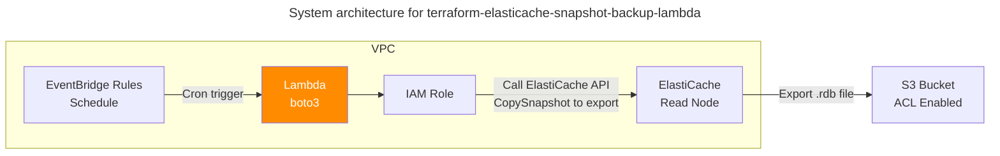

# terraform-elasticache-snapshot-backup-lambda

Automated ElastiCache snapshot export solution using Lambda and EventBridge Rule.

## Background

ElastiCache automatically creates daily snapshots, but it lacks native support for scheduled exports of `.rdb` snapshot files to S3. Manual exports through the AWS Console are possible but impractical for regular backups.

This Terraform-based Lambda solution addresses this gap by:
- Automating the snapshot export process on a cron schedule via EventBridge Rule
- Exporting ElastiCache snapshots to S3 as `.rdb` files for long-term storage
- Providing Infrastructure as Code for reproducible and version-controlled deployments

## System Architecture

A Lambda function creates ElastiCache snapshots using the Boto3 [ElastiCache API](https://boto3.amazonaws.com/v1/documentation/api/latest/reference/services/elasticache.html) client and automatically exports them to S3 on a scheduled basis.



## Configuration

### Lambda Environment Variables

These environment variables must be configured in the Lambda function settings:

| Variable | Description | Required | Example | Configured In |
|----------|-------------|----------|---------|---------------|
| `CACHE_CLUSTER_ID` | ElastiCache cluster ID (Read Replica node) | Yes | `my-redis-replica-001` | Lambda ENV (manual) |
| `S3_BUCKET_NAME` | S3 bucket name for storing `.rdb` files | Yes | `elasticache-backups` | Lambda ENV (manual) |
| `TZ` | Timezone for Lambda execution | No | `Asia/Seoul` | Terraform (`main.tf`) |

## Details

### Export .rdb file from ElastiCache to S3

The Lambda function exports ElastiCache backup files to an S3 bucket as `.rdb` files by calling the `copy_snapshot()` method on the ElastiCache boto3 client.

```python
        response = elasticache_client.copy_snapshot(
            SourceSnapshotName=snapshot_name,
            TargetSnapshotName=target_snapshot_name,
            TargetBucket=S3_BUCKET_NAME
        )
```

## Caveats

### Single Cluster Support

This Lambda function supports only one ElastiCache cluster per deployment. To backup multiple clusters, deploy separate Lambda functions with different `CACHE_CLUSTER_ID` environment variables.

### IAM Permissions

According to [this AWS re:Post question](https://repost.aws/questions/QUuo6m69KqQZirwRnt1A3TRA/export-elasticache-backup-to-s3-using-boto3#AN6F-h_bUWQKeKBFzDjMozcg), the IAM role used by the Lambda function requires the `s3:ListAllMyBuckets` permission.

### S3 ACL Configuration

Since ElastiCache directly uploads to S3, [you must enable S3 ACLs and specify the external account as a grantee](https://stackoverflow.com/questions/70753290/unable-to-copy-elasticache-backup) for the operation to succeed.

## License

This project is licensed under the MIT License - see the [LICENSE](LICENSE) file for details.
