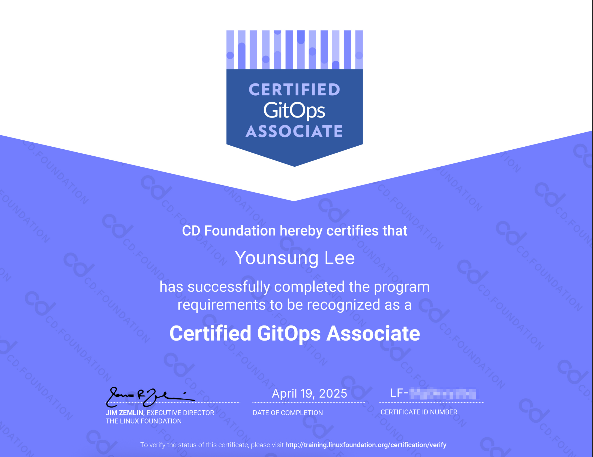

# Certified GitOps Associate (CGOA)

## Summary

I took and passed the Certified GitOps Associate (CGOA) exam on April 20, 2025.

This mock exam is based on the [CGOA Curriculum](https://training.linuxfoundation.org/certification/certified-gitops-associate-cgoa/).

## Disclaimer

*The mock exam questions presented below are original creations intended solely for study and practice purposes. They are not official CGOA exam questions, have no affiliation with the actual certification exam, and have been developed independently without using any proprietary or confidential exam materials. Their purpose is illustrative and educational, based on the publicly available CGOA curriculum outline.*

## CGOA Exam Domains & Competencies (%)

| Domain              | Percentage |
|---------------------|------------|
| GitOps Terminology  | 20%        |
| GitOps Principles   | 30% ⭐     |
| Related Practices   | 16%        |
| GitOps Patterns     | 20%        |
| Tooling             | 14%        |
| **Total**           | **100%**   |

## CGOA Mock Exam

**1. In GitOps, what does 'Desired State' mean?**

*   A) The actual state in which the system is currently operating
*   B) The aggregate of all configuration data sufficient to recreate the system
*   C) A snapshot of the system at a specific point in time
*   D) The Git commit log that tracks system changes

View Answer & Explanation

**Answer: B)**

**Domain: GitOps Terminology (20%)**

**Explanation:** The Desired State is the aggregate of all configuration data that is sufficient to recreate the system so that instances of the system are behaviorally indistinguishable. This configuration data generally does not include persistent application data, e.g., database contents, though often does include credentials for accessing that data, or configuration for data recovery tools running on that system. (Reference: 'GitOps Terminology' section in the study guide)

---

**2. What does the GitOps core principle 'Pulled Automatically' imply?**

*   A) The CI pipeline automatically pushes changes to the cluster.
*   B) An agent within the cluster continuously monitors the state store (e.g., Git) and pulls changes to apply them.
*   C) Developers manually run the `git pull` command to update the cluster.
*   D) Changes are pulled from the state store only when an event occurs.

View Answer & Explanation

**Answer: B)**

**Domain: GitOps Principles (30%)**

**Explanation:** The 'Pulled Automatically' principle specifies that software agents must be able to access the desired state from the state store at *any* time, not only when there is an intentional change triggering a push event. This is based on a pull mechanism where the agent continuously checks the state store and pulls changes, which is a prerequisite for the 4th principle, 'Continuously Reconciled'. (Reference: 'GitOps Principles' and 'Pull vs. Event-driven' sections in the study guide)

---

**3. Which of the following best describes 'State Drift'?**

*   A) A new commit being added to the Git repository.
*   B) The actual operating state of the system diverging from the Desired State defined in Git.
*   C) A conflict arising from multiple developers modifying code simultaneously.
*   D) The process of pods automatically scaling within a cluster.

View Answer & Explanation

**Answer: B)**

**Domain: GitOps Terminology (20%)**

**Explanation:** State Drift refers to when a system's actual state has moved or is in the process of moving away from the desired state. Detecting and automatically correcting this drift to maintain the desired state is crucial in GitOps. (Reference: 'GitOps Terminology' section in the study guide)

---

**4. In a Kubernetes environment, which deployment pattern applies new versions incrementally with minimal downtime?**

*   A) Recreate
*   B) Rolling Updates
*   C) Blue-Green
*   D) Canary

View Answer & Explanation

**Answer: B)**

**Domain: GitOps Patterns (20%)**

**Explanation:** Rolling Updates are natively supported by Kubernetes and apply updates incrementally without taking the service down. This strategy updates pods one by one, ensuring that a certain number of old and new pods run simultaneously, minimizing downtime and maintaining partial application availability during the update. (Reference: 'Deployment and Release Patterns' section in the study guide)

---

**5. Which of the following is **NOT** a typical Reconciliation Engine used in GitOps?**

*   A) Argo CD
*   B) Flux
*   C) Jenkins X
*   D) Prometheus

View Answer & Explanation

**Answer: D)**

**Domain: Tooling (14%)**

**Explanation:** Argo CD, Flux, and Jenkins X are examples of Reconciliation Engines that synchronize the state of a Kubernetes cluster with a state store (like a Git repository) and maintain the desired state. Prometheus, on the other hand, is a monitoring and alerting system used for collecting metrics and observing the system's state. (Reference: 'Reconciliation Engines' and 'Interoperability with Notifications, Observability, and Continuous Integration Tools' sections in the study guide)

---

**6. Which of the following is least related to GitOps practices?**

*   A) Infrastructure as Code (IaC)
*   B) Configuration as Code (CaC)
*   C) Continuous Integration (CI)
*   D) Manual Server Provisioning

View Answer & Explanation

**Answer: D)**

**Domain: Related Practices (16%)**

**Explanation:** GitOps emphasizes managing infrastructure (IaC) and configuration (CaC) through code, integrated with CI/CD pipelines for automation. Manual server provisioning contradicts these principles of automation and code-based management. (Reference: 'Related Practices' section in the study guide)

---

**7. What does the 'Declarative' principle of GitOps emphasize?**

*   A) Writing procedural scripts for system state changes.
*   B) Specifying the desired system state and letting the system figure out how to achieve it.
*   C) Version controlling all changes through Git.
*   D) Operators directly intervening to manage the system state.

View Answer & Explanation

**Answer: B)**

**Domain: GitOps Principles (30%)**

**Explanation:** The 'Declarative' principle involves using a configuration that describes the desired operating state of a system (the 'what') without specifying the procedures for how that state will be achieved (the 'how'). This separates the configuration (desired state) from the implementation (commands, API calls, scripts, etc.) used to achieve that state. (Reference: 'GitOps Principles' and 'GitOps Terminology' sections in the study guide)

---

**8. Which of the following is **NOT** a GitOps tool?**

*   A) Argo CD
*   B) Flux
*   C) Jenkins X
*   D) Prometheus

View Answer & Explanation

**Answer: D)**

**Domain: Tooling (14%)**

**Explanation:** Argo CD, Flux, and Jenkins X are examples of GitOps tools that help manage the desired state of a Kubernetes cluster. Prometheus, on the other hand, is a monitoring and alerting system used for collecting metrics and observing the system's state. (Reference: 'GitOps Terminology' section in the study guide)

---

**9. Which statement best describes the primary approach Kustomize takes for managing Kubernetes manifests in a GitOps workflow?**

*   A) It relies heavily on a complex templating engine to generate manifests.
*   B) It packages applications and their dependencies into versioned archives called Helm charts.
*   C) It provides a template-free way to customize base YAML manifests using overlays.
*   D) It primarily focuses on injecting secrets into Kubernetes resources during deployment.

View Answer & Explanation

**Answer: C)**

**Domain: Tooling (14%)**

**Explanation:** Kustomize offers a template-free approach to customizing application configuration. It allows users to manage Kubernetes manifests by defining a base configuration and applying overlays or patches to customize it for different environments or variations without modifying the original base files. This aligns well with the declarative nature of GitOps. (Reference: 'Manifest Format and Packaging' section in the study guide)

---

**10. How is Configuration as Code (CaC) related to GitOps?**

*   A) GitOps is a specific implementation or subset of CaC.
*   B) CaC is considered a foundational practice *within* the GitOps framework, used for managing the desired state.
*   C) GitOps and CaC are independent methodologies with no direct overlap.
*   D) CaC focuses only on application configuration, while GitOps manages the entire infrastructure.

View Answer & Explanation

**Answer: B)**

**Domain: Related Practices (16%)**

**Explanation:** Configuration as Code (CaC) is the practice of managing and provisioning configuration through machine-readable definition files, rather than manual configuration or interactive tools. GitOps heavily relies on CaC principles by using a version-controlled system (like Git) to store the declarative configuration representing the desired state of the system. Therefore, CaC is a fundamental building block or related practice that enables GitOps. GitOps adds the operational model around reconciliation and the pull-based mechanism. (Reference: 'Related Practices' section in the study guide)

---

**11. What aspect of GitOps primarily facilitates 'Compliance and Auditing'?**

*   A) The automatic rollback capabilities provided by the reconciliation engine.
*   B) The use of event-driven triggers for immediate deployments.
*   C) The immutable, versioned history of all desired state changes meticulously tracked in the Git repository.
*   D) The integration with external secret management systems like HashiCorp Vault.

View Answer & Explanation

**Answer: C)**

**Domain: GitOps Principles (30%)**

**Explanation:** GitOps inherently enhances compliance and auditing because every change to the desired state of the system is recorded as a commit in the Git repository. This Git history serves as an immutable audit log, providing a clear record of who made what change and when. This traceability makes it easier to meet compliance requirements and perform audits on system configurations and changes over time. While other aspects like rollbacks or secrets management are important, the Git history is the core facilitator for auditing. (General GitOps principles, implicitly supported by versioning principle)

---

**12. Which of the following actions is **CONTRARY** to the core principles of GitOps?**

*   A) Defining the desired state of an application using declarative YAML manifests stored in a Git repository.
*   B) Using an agent like Argo CD or Flux to automatically pull changes from Git and apply them to the cluster.
*   C) Performing a `kubectl edit deployment` directly on the production cluster to quickly fix an issue.
*   D) Rolling back to a previous stable state by reverting a commit in the Git repository.

View Answer & Explanation

**Answer: C)**

**Domain: GitOps Principles (30%)**

**Explanation:** A fundamental principle of GitOps is that the Git repository is the single source of truth for the desired state of the system. All changes should be made through commits to the repository, which then trigger the reconciliation process. Making direct manual changes to the cluster (e.g., using `kubectl edit`) bypasses the Git repository, violates the single source of truth principle, and introduces state drift that GitOps aims to prevent. (Reference: Core GitOps principles)

---

**13. What does the term 'immutable' mean in the context of GitOps and immutable infrastructure?**

*   A) Infrastructure configurations are declared in YAML files rather than using imperative scripts.
*   B) Once infrastructure components (like container images or VM images) are deployed, they are never modified in place; updates are made by replacing them with new versions built from the source.
*   C) The reconciliation engine automatically reverts any manual changes made directly to the infrastructure.
*   D) The system state can be easily rolled back to any previous version stored in the Git repository.

View Answer & Explanation

**Answer: B)**

**Domain: GitOps Principles (30%)**

**Explanation:** Immutability, in the context of GitOps and immutable infrastructure, means that deployed artifacts (like container images, server configurations derived from the Git state) are never updated or patched after deployment. Instead of modifying a running component, any change requires building a *new* version of the artifact and deploying it to replace the old one entirely. This approach ensures consistency, predictability, and easier rollbacks, aligning with the 'Versioned and Immutable' principle of GitOps where the desired state in Git dictates the creation of these immutable artifacts. (Reference: 'GitOps Principles' section, related to 'Versioned and Immutable')

---

**14. What does a 'Declarative Description' in GitOps primarily focus on?**

*   A) The specific sequence of commands needed to configure the system.
*   B) The desired end state of the system, without specifying the exact steps to reach it.
*   C) The history of changes made to the configuration files over time.
*   D) The real-time monitoring alerts generated by the system.

View Answer & Explanation

**Answer: B)**

**Domain: GitOps Terminology (20%)**

**Explanation:** A declarative description defines the *desired state* ('what') of the system, such as the number of replicas, container image versions, or network policies. It explicitly avoids detailing the procedural steps ('how') required to achieve that state. The system's reconciliation engine is responsible for interpreting this desired state and taking the necessary actions to make the actual state match. This contrasts with imperative approaches, which focus on executing a sequence of commands. (Reference: 'GitOps Terminology' section in the study guide)

---

**15. What is a recommended practice for managing different environments (e.g., development, staging, production) in GitOps?**

*   A) Using a single Git branch for all environments and manually editing configuration files directly before each deployment.
*   B) Creating completely separate Git repositories for each individual environment.
*   C) Employing strategies like environment-specific branches (e.g., `dev`, `staging`, `main`) or directory structures (e.g., base manifests with environment-specific overlays) within a single repository, often utilizing tools like Kustomize or Helm.
*   D) Configuring environment differences directly within the cluster using `kubectl` commands after the initial deployment.

View Answer & Explanation

**Answer: C)**

**Domain: GitOps Patterns (20%)**

**Explanation:** Recommended practices for managing multiple environments in GitOps typically involve structuring the state store (Git repository) effectively. Common patterns include using separate branches for each environment (where changes are promoted, often via pull requests) or organizing the repository with a base configuration and environment-specific overlays/patches (common with Kustomize) or values files (common with Helm).

⚠️ *Key takeaway: Organizing by directory/overlays or using environment-specific values files are highly recommended patterns.* These approaches maintain a clear separation of concerns while leveraging Git's versioning and collaboration features. Manually editing files before deployment (A), using entirely separate repositories for potentially shared configurations (B), or making direct cluster changes (D) are generally discouraged as they can undermine the consistency, traceability, and automation benefits of GitOps. (Reference: 'GitOps Patterns' - Architecture Patterns, State Store Management sections in the study guide)

---

**16. What is a key advantage of applying GitOps principles for managing configurations across multiple Kubernetes clusters (Cross-Cluster Management)?**

*   A) It automatically optimizes resource utilization specific to each cluster's hardware profile.
*   B) It enables direct, imperative command execution simultaneously on all managed clusters for urgent fixes.
*   C) It ensures consistent application deployment, configuration, and policy enforcement across numerous clusters by using Git as the single source of truth.
*   D) It inherently provides built-in service mesh capabilities for seamless inter-cluster communication.

View Answer & Explanation

**Answer: C)**

**Domain: GitOps Patterns (20%)**

**Explanation:** GitOps provides a powerful pattern for managing multiple Kubernetes clusters. By defining the desired state for applications, configurations, and policies declaratively in Git, organizations can ensure that this state is consistently applied across all targeted clusters by reconciliation agents (like Argo CD or Flux). This centralizes management, simplifies auditing, prevents configuration drift between clusters, and makes scaling operations across a fleet of clusters much more manageable and reliable. Option A is incorrect as optimization is workload/scheduler specific. Option B contradicts the declarative, pull-based nature of GitOps. Option D describes service mesh functionality, which is related but distinct from the core GitOps configuration management benefit.

---

**17. What is a key difference between traditional Continuous Integration (CI) and GitOps?**

*   A) CI focuses on building and testing code, while GitOps focuses on deploying and continuously reconciling the system's desired state defined in Git.
*   B) GitOps replaces the need for a CI pipeline entirely.
*   C) CI is responsible for managing the desired state in the Git repository, while GitOps applies it.
*   D) There is no fundamental difference; GitOps is just another name for a CI/CD pipeline integrated with Git.

View Answer & Explanation

**Answer: A)**

**Domain: Related Practices (16%) / GitOps Principles (30%)**

**Explanation:** While often used together, CI and GitOps serve distinct purposes. CI pipelines typically automate the building, testing, and sometimes packaging of application code triggered by code commits. GitOps, however, focuses on the operational aspect: it uses the Git repository as the source of truth for the *desired state* of the infrastructure and applications, and employs reconciliation agents (like Flux or Argo CD) to automatically ensure the *actual state* of the system converges to this desired state. CI outputs (like container images) often become part of the desired state declared in Git for GitOps to act upon, but GitOps itself is primarily concerned with deployment and state management, not the build/test process.

---

**18. What is the primary difference between the 'Pulled Automatically' (Pull-based) principle and an 'Event-driven' approach in GitOps regarding how state changes are detected and applied?**

*   A) Pull-based relies on developers manually running `git pull` commands on the cluster, while Event-driven uses automated webhooks.
*   B) Pull-based involves an agent periodically checking the state store (e.g., Git) for changes to pull, while Event-driven involves the agent reacting to specific external notifications (e.g., Git push webhook, new image notification) to trigger reconciliation.
*   C) Event-driven approaches completely replace the need for the agent to poll the state store in modern GitOps implementations.
*   D) Pull-based is primarily used for infrastructure configuration, whereas Event-driven is used for application deployments.

View Answer & Explanation

**Answer: B)**

**Domain: GitOps Principles (30%) / GitOps Terminology (20%)**

**Explanation:** The core 'Pulled Automatically' principle emphasizes that an agent within the cluster *proactively and periodically polls* the state store (like a Git repository) to detect any differences between the desired state and the actual state, and then *pulls* the necessary changes to reconcile. In contrast, an Event-driven approach relies on *external triggers* or notifications – such as a webhook sent upon a `git push` or a notification from an image registry about a new image build – to initiate the reconciliation process. While event-driven mechanisms can provide faster reaction times to specific events, the pull model ensures continuous reconciliation and the ability for the agent to detect drift even without an explicit event. Many tools use a hybrid approach, combining polling with event triggers. Option A is incorrect because GitOps automation avoids manual pulls on the cluster. Option C is incorrect as polling often co-exists with event triggers for robustness. Option D incorrectly segregates the approaches by configuration type.

