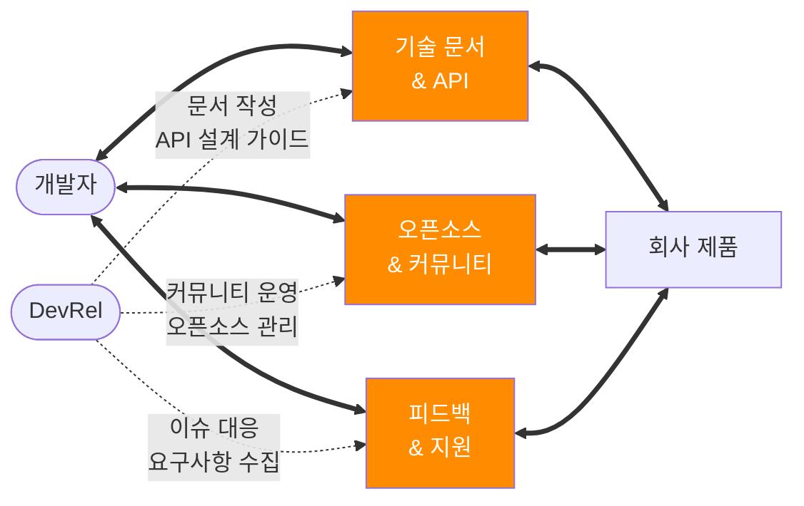

# Developer Relations (DevRel) 가이드

## 개요

Developer Relations는 개발자 커뮤니티와 관계를 구축하고 유지하는 전문 역할로, 기술적 전문성과 커뮤니케이션 능력을 결합하여 개발자들이 제품과 서비스를 효과적으로 활용할 수 있도록 지원합니다.

## 핵심 목표

DevRel의 핵심은 개발자 커뮤니티와 회사 사이에서 양방향 소통의 다리 역할을 하는 것입니다. 단순히 제품을 홍보하는 것이 아니라, 개발자들의 실제 니즈를 이해하고 회사에 전달하며, 동시에 회사의 기술과 제품을 개발자들이 쉽게 활용할 수 있도록 돕는 것이 가장 중요한 목표입니다.
특히 신뢰 구축이 핵심인데, 이는 일회성 이벤트가 아닌 지속적인 관계 형성과 가치 제공을 통해 이루어집니다.

구체적으로:
- 개발자 성공 지원: 개발자들이 제품/플랫폼을 성공적으로 활용할 수 있도록 지원
- 피드백 루프 구축: 커뮤니티 피드백을 제품 개발팀에 전달하여 개발자 경험(DX) 개선
- 생태계 성장: 기술 콘텐츠와 교육을 통해 개발자 생태계 전체의 성장 촉진

## 주요 역할과 책임

### 커뮤니티 관리
- 개발자 커뮤니티와의 관계 구축 및 유지
- 온라인 포럼 및 소셜 미디어에서의 적극적 참여
- 개발자 피드백 수집 및 제품팀과의 연결

### 기술 콘텐츠 제작
- 기술 문서 작성 및 업데이트
- 튜토리얼, 가이드, 샘플 코드 개발
- 기술 블로그 포스트 및 동영상 콘텐츠 제작
- API 문서 및 SDK 가이드 작성

### 이벤트 및 프레젠테이션
- 컨퍼런스, 밋업, 웨비나에서의 발표
- 워크숍 및 해커톤 주최
- 제품 데모 및 기술 시연

### 기술 지원
- 개발자 질문 및 이슈 해결
- 기술적 문제 해결 지원
- 제품 사용법 안내 및 베스트 프랙티스 공유

## 필수 스킬셋

### 기술적 역량
- **프로그래밍 언어**: 주요 언어 2-3개 이상 숙련
- **API 이해**: REST, GraphQL, SDK 사용 경험
- **클라우드 플랫폼**: AWS, Azure, GCP 중 하나 이상
- **개발 도구**: Git, CI/CD, 컨테이너 기술
- **데이터베이스**: SQL/NoSQL 기본 지식

### 커뮤니케이션 스킬
- **기술 글쓰기**: 복잡한 기술을 명확하게 설명
- **퍼블릭 스피킹**: 컨퍼런스 발표 및 라이브 데모
- **소셜 미디어**: Twitter, LinkedIn, GitHub 활용
- **다국어 능력**: 글로벌 커뮤니티 대응

### 마케팅 & 비즈니스
- **컨텐츠 마케팅**: SEO, 소셜 미디어 마케팅
- **이벤트 기획**: 밋업, 컨퍼런스, 워크숍 조직
- **데이터 분석**: 커뮤니티 성장 지표 분석
- **제품 이해**: 비즈니스 모델 및 경쟁 환경 분석

## 학습 로드맵

### 1단계: 기술 기반 구축 (3-6개월)
- [ ] 핵심 프로그래밍 언어 습득
- [ ] Git 및 버전 관리 시스템 숙달
- [ ] 클라우드 플랫폼 기초 학습
- [ ] API 설계 및 사용법 이해

### 2단계: 커뮤니케이션 스킬 개발 (3-6개월)
- [ ] 기술 블로그 운영 시작
- [ ] 오픈소스 프로젝트 기여
- [ ] 로컬 밋업 참여 및 발표
- [ ] 소셜 미디어 활동 강화

### 3단계: 전문성 심화 (6-12개월)
- [ ] 특정 기술 스택 전문가 되기
- [ ] 컨퍼런스 발표 경험 쌓기
- [ ] 커뮤니티 리더십 역할 수행
- [ ] 멘토링 및 교육 경험 축적

### 4단계: DevRel 실무 경험 (지속적)
- [ ] DevRel 팀 인턴십 또는 주니어 포지션
- [ ] 제품 론칭 및 개발자 온보딩 참여
- [ ] 글로벌 개발자 커뮤니티 활동
- [ ] 업계 네트워킹 및 파트너십 구축

## 커리어 패스

### 주니어 Developer Advocate (1-3년)
- 기술 문서 작성 및 샘플 코드 개발
- 커뮤니티 질문 답변 및 기술 지원
- 소규모 이벤트 발표 및 워크숍 보조

### Developer Advocate (3-5년)
- 독립적인 컨텐츠 제작 및 전략 수립
- 주요 컨퍼런스 발표 및 키노트
- 제품 로드맵에 개발자 피드백 반영

### Senior Developer Advocate (5-8년)
- DevRel 전략 및 프로그램 리더십
- 글로벌 커뮤니티 관리 및 파트너십
- 크로스 펑셔널 팀과의 협업 주도

### DevRel Manager/Director (8년+)
- DevRel 팀 관리 및 예산 책임
- 회사 차원의 개발자 생태계 전략
- 경영진 및 이해관계자와의 소통

## 주요 도구 및 플랫폼

### 콘텐츠 제작
- **문서 작성**: Notion, GitBook, Confluence
- **코드 관리**: GitHub, GitLab, Bitbucket
- **디자인**: Figma, Canva, Adobe Creative Suite
- **동영상**: OBS Studio, Loom, YouTube

### 커뮤니티 관리
- **소셜 미디어**: Twitter, LinkedIn, Reddit
- **포럼**: Discord, Slack, Stack Overflow
- **이벤트**: Eventbrite, Meetup, Hopin
- **분석**: Google Analytics, Mixpanel, Amplitude

### 개발 도구
- **API 테스트**: Postman, Insomnia
- **모니터링**: Datadog, New Relic, Sentry
- **CI/CD**: Jenkins, GitHub Actions, CircleCI
- **클라우드**: AWS, Azure, GCP

## 성공 지표 (KPI)

### 커뮤니티 성장
- 개발자 등록 수 및 활성 사용자
- 소셜 미디어 팔로워 및 참여율
- 이벤트 참석자 수 및 만족도
- 커뮤니티 포럼 활동 지표

### 콘텐츠 성과
- 기술 문서 조회수 및 유용성 평가
- 블로그 포스트 트래픽 및 공유율
- 동영상 콘텐츠 조회수 및 구독자 수
- 튜토리얼 완주율 및 피드백

### 제품 영향
- 개발자 피드백을 통한 제품 개선 사례
- 새로운 기능 채택률
- 개발자 지원 요청 감소율
- 파트너십 및 통합 증가

## 추천 리소스

### 학습 플랫폼
- [Developer Marketing Alliance](https://developermarketing.io/)
- [DevRel Collective](https://devrelcollective.fun/)
- [The DevRel Handbook](https://devrelhandbook.com/)

### 커뮤니티
- DevRel 전문가 네트워크 및 슬랙 채널
- 컨퍼런스: DevRelCon, DevXCon
- 팟캐스트: DevRel Radio, Community Pulse

### 도서
- "Developer Relations: How to Build and Grow a Successful Developer Program"
- "The Business Value of Developer Relations"
- "Community Building for Developer Tools"

---

*이 가이드는 [roadmap.sh/devrel](https://roadmap.sh/devrel)을 참고하여 작성되었습니다.*
