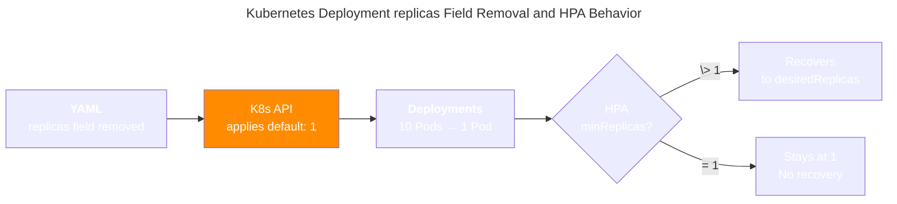
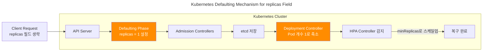

# HPA resets single replicas

## 문제 상황

HPA가 적용된 Deployment에서 `.spec.replicas` 필드를 제거하고 ArgoCD sync를 실행하면:
1. 파드 개수가 일시적으로 1개로 축소됨
2. HPA가 감지하여 minReplicas로 복구

## 근본 원인

Kubernetes의 구조적 딜레마로 인한 문제:

### replicas 필드 유지 시 → Pod Flapping ([Issue #25238](https://github.com/kubernetes/kubernetes/issues/25238))
- HPA Controller와 Deployment Controller가 replicas 값을 두고 무한 경쟁
- 파드가 계속 생성/삭제 반복

### replicas 필드 제거 시 → Reset to 1 ([Issue #67135](https://github.com/kubernetes/kubernetes/issues/67135))



- Kubernetes API Server가 기본값 1을 자동 설정
- 일시적으로 파드가 1개로 축소됨

## 해결 방안

### Server-side Apply: 부분적 개선

**ArgoCD에서 Server-side Apply 활성화:**

```bash
argocd app set APP_NAME --sync-option ServerSideApply=true
```

**개선되는 부분:**
- Deployment Controller와 HPA Controller 간 지속적인 충돌 (Pod flapping) 해결
- managedFields를 통한 .spec.replicas 필드 소유권 관리 (Controller 레벨의 충돌만 해결)
- HPA가 replicas 필드 소유권을 자동으로 획득

**여전히 남는 문제:**
- replicas 필드 제거 시 기본값 1 적용은 동일하게 발생
- HPA 활성화 초기의 일시적 reset 여전히 존재
- Kubernetes API Server의 [defaulting 메커니즘](https://kubernetes.io/docs/reference/access-authn-authz/admission-controllers/)은 변하지 않음. Kubernetes의 Defaulting Mechanism은 API Server가 리소스 생성/수정 시 생략된 필드에 기본값을 자동으로 설정하는 과정입니다.

**결론:** Server-side Apply는 **부분적 개선**이지만 **완전한 해결책이 아님**

### 권장: replicas 필드 제거 + 적절한 시점 선택

**장점**: Pod flapping 없음, 구조적 충돌 해결
**단점**: 배포 시 순간적 서비스 중단 가능성

**ArgoCD 모범사례**: ArgoCD의 [Leaving Room for Imperativeness](https://argo-cd.readthedocs.io/en/stable/user-guide/best_practices/#leaving-room-for-imperativeness) 모범사례는 HPA 초기 도입 시 deployment 리소스에 .spec.replicas 필드를 아예 정의하지 않는 것입니다.

```yaml
# my-app/templates/deployment.yaml
spec:
  # Do not include replicas in the manifests if you want replicas to be controlled by HPA
  {{- if not .Values.autoscaling.enabled }}
  replicas: {{ .Values.replicaCount }}
  {{- end }}
```

**최적 배포 시점:**
- 서비스 트래픽이 가장 적은 시간대 (새벽 2-4시)
- 계획된 유지보수 윈도우 기간
- 주말이나 휴일 (B2B 서비스)

**사전 준비:**
```bash
# HPA minReplicas 확인
kubectl get hpa -o yaml

# 현재 파드 수 확인  
kubectl get deployment

# 모니터링 준비
kubectl get events --watch
```

**실행 절차:**
1. 트래픽 최소 시점 확인
2. replicas 필드 제거 후 ArgoCD sync
3. HPA 복구 시간 모니터링 (30초-2분)
4. 서비스 정상 동작 확인

**복구 시간 단축:**
```yaml
# HPA 설정 최적화
behavior:
  scaleUp:
    stabilizationWindowSeconds: 0
    policies:
    - type: Percent
      value: 100
      periodSeconds: 15
```

### 대안: Pod flapping 감수

replicas 필드를 유지하되 지속적인 불안정성을 감수하는 방법

**적용 환경**: 다운타임을 절대 허용할 수 없는 프로덕션 환경

## 중요 사실

**기본값 1 적용을 완전히 피할 수 있는가?**

**불가능**: Kubernetes API Server의 defaulting 메커니즘상 피할 방법 없음



**실패하는 시도들:**
- **Server-side Apply**: Pod flapping은 해결하지만 기본값 1 적용은 여전히 발생
- **Strategic Merge Patch**: 필드 제거 시 기본값 처리는 동일
- **Custom Admission Controller**: API Server의 defaulting 이후에 실행되므로 늦음

**현재 상황**: Kubernetes의 구조적 한계로 인해 **완벽한 해결책은 존재하지 않음**

## 모니터링

```bash
# HPA 상태 확인
kubectl describe hpa

# Pod 이벤트 모니터링
kubectl get events --field-selector involvedObject.kind=Pod

# ArgoCD sync 상태
argocd app get APP_NAME
```
