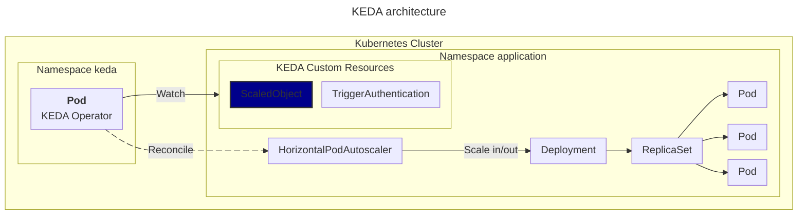

# mermaid-style-guide

내 개인적인 머메이드 스타일 가이드. 테크 블로그 다이어그램이나 아키텍처를 mermaid로 그릴때 참고하려고 작성했습니다.

## 스타일 가이드

### 1. 여백 줄이기

```json
"flowchart": {
  "nodeSpacing": 20,        // 같은 레벨 노드 간 간격 [px]
  "rankSpacing": 25,        // 레벨 간 간격 [px]
  "curve": "linear",        // 곡선 타입 (linear, basis, cardinal)
  "padding": 10,            // 다이어그램 콘텐츠와 다이어그램 경계(테두리) 사이의 여백 [px]
  "useMaxWidth": true,      // 최대 너비 사용
  "htmlLabels": true        // HTML 레이블 사용
}
```

```raw
---
title: KEDA architecture
---
%% Style %%
%%{
    init: {
        "flowchart": {
            "nodeSpacing": 15,
            "rankSpacing": 15,
            "padding": 0
        }
    }
}%%

%% Main Diagram %%
flowchart LR
  subgraph "Kubernetes Cluster"
    direction LR
    subgraph "Namespace keda"
        keda["`**Pod**
        KEDA Operator`"]
    end
    subgraph "Namespace application"
      direction LR
      subgraph kedacr["KEDA Custom Resources"]
        so["ScaledObject"]
        ta["TriggerAuthentication"]
      end
      hpa["HorizontalPodAutoscaler"]
      d["Deployment"]
      r["ReplicaSet"]
      p1["Pod"]
      p2["Pod"]
      p3["Pod"]
    end
  end

  keda e1@--Reconcile--> hpa 
  hpa --Scale in/out--> d --> r --> p1 & p2 & p3
  keda --Watch--> kedacr 

  style so fill:darkblue,stroke:#333,stroke-width:2px
  e1@{ animate: true }
```


