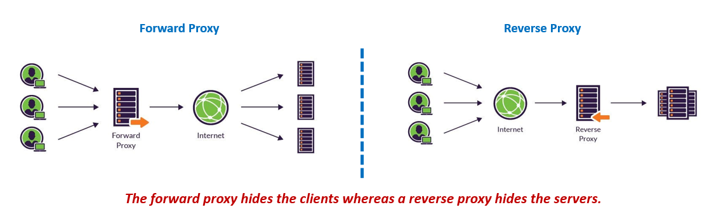
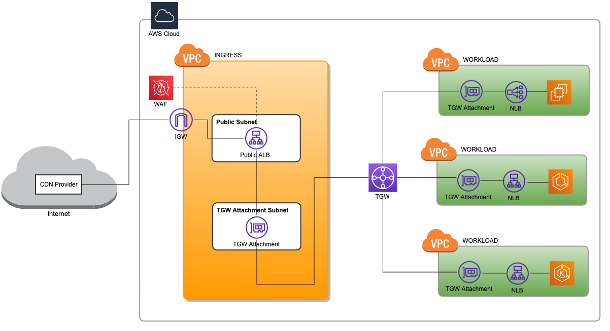

# Serverless Reverse Proxy

## Summary

AWS에서 전용 프록시 EC2 서버 없이 서버리스로 리버스 프록시를 구현할 수 있는 방법을 소개합니다.

## Background Knowledge

### Reverse Proxy

리버스 프록시(Reverse Proxy)는 클라이언트와 백엔드 서버 사이에 위치하여 클라이언트 요청을 대신 받아 백엔드 서버로 전달하고, 응답을 다시 클라이언트에게 반환하는 서버입니다. 트래픽 방향이 반대이기 때문에 리버스 프록시라고 부릅니다. 반대로 포워드 프록시(Forward Proxy)는 클라이언트를 대신하여 서버에 요청을 보내는 프록시로, 주로 기업 내부에서 인터넷 접근 제어나 캐싱 목적으로 사용됩니다.

아래 그림은 포워드 프록시와 리버스 프록시의 차이를 나타낸 그림입니다.

일반적으로 Nginx, HAProxy, Envoy 등의 오픈소스 리버스 프록시를 EC2에 설치해서 구현하지만, AWS에서는 ALB와 NLB만으로 구현할 수 있습니다.

## Implementation

결과적으로 Public ALB를 Internal NLB에 연결하는 방식으로 서버리스 리버스 프록시를 구현할 수 있습니다.

ALB에 연결된 AWS WAF는 들어오는 트래픽을 필터링하고, 필터링된 트래픽을 중앙 네트워크 게이트웨이(Transit Gateway)를 통해 Internal NLB로 전달합니다. Internal NLB는 백엔드 서버(파드)로 트래픽을 전달합니다.

자세한 내용은 아래 링크를 참고하세요.

- [Serverless Ingress Solution on AWS](https://jackiechen.blog/2022/09/07/serverless-ingress-solution-on-aws/)
- [Using the AWS Network Firewall for centralized ingress](https://docs.aws.amazon.com/whitepapers/latest/building-scalable-secure-multi-vpc-network-infrastructure/using-network-firewall-for-centralized-ingress.html)