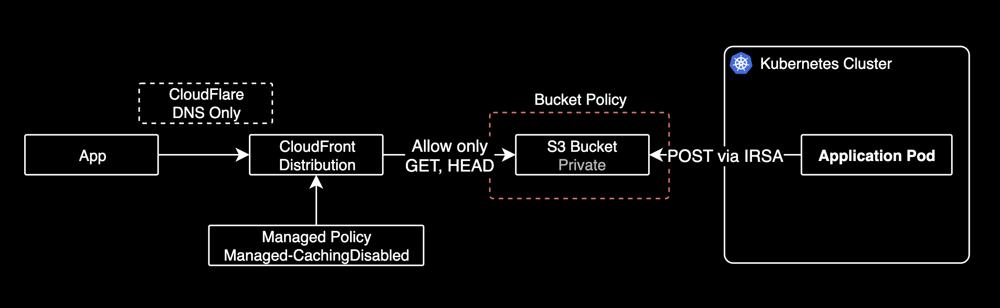

Static file을 안전하게 서빙하려면

CloudFront를 앞에 두고 서빙하는 것이 좋다.



다행히 CloudFront는 캐싱 정책을 설정할 수 있어서, 캐시 비활성화 옵션을 적용할 수 있다.

```bash
x-amz-cf-pop: ICN57-P3
x-cache: Miss from cloudfront
```

1. 클라이언트는 엣지 로케이션(ICN57-P3)를 찔렀다. x-amz-cf-pop 헤더에서 유추가능
2. Miss from cloudfront로 캐시 데이터가 없음을 확인
3. 엣지 로케이션에 데이터가 존재하지 않으므로 원본 Origin S3에서 가져옴
4. 클라이언트가 텀을 두고 여러번 시도해도 모두 동일하게 원본 Origin S3에서 가져오고 있음
